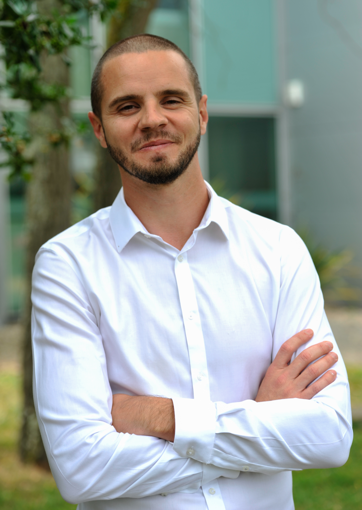
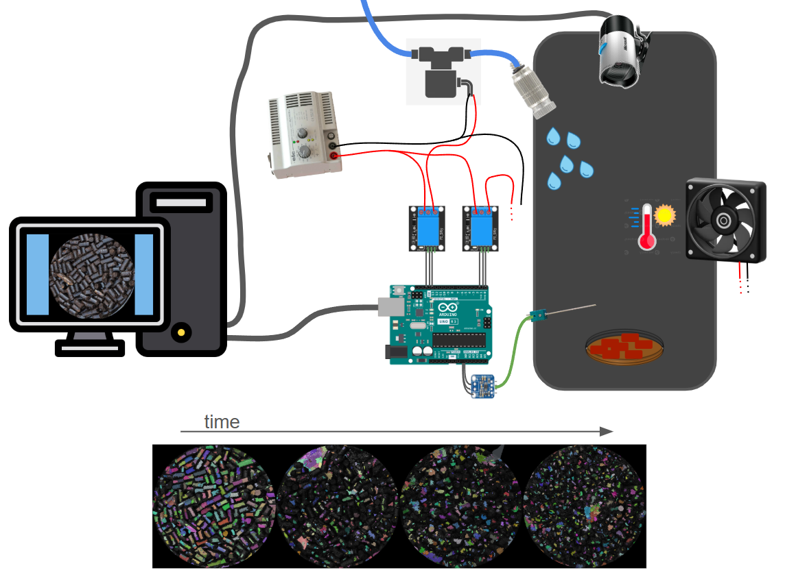
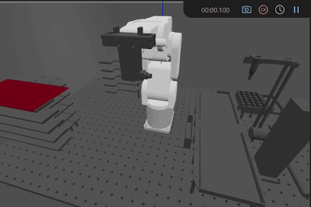
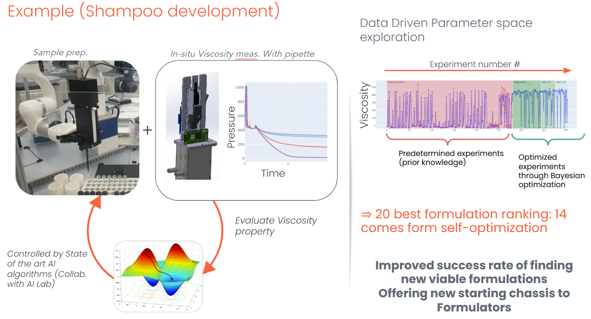
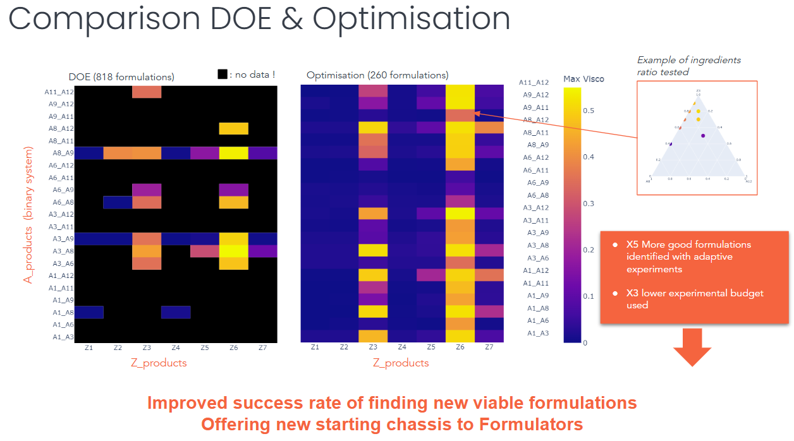
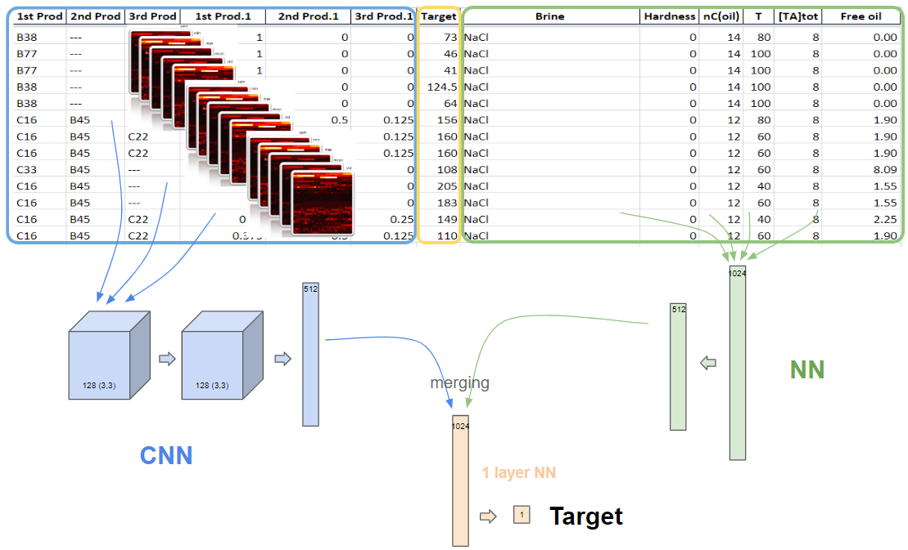
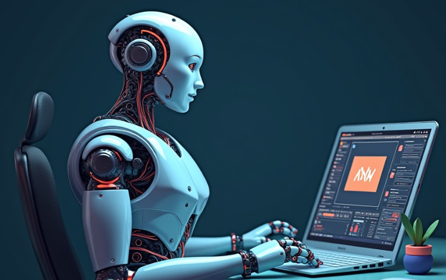

# Jordy Bonnet
 

Starting my career at the [Laboratory of the Future (LoF) - Syensqo](https://www.lof.cnrs.fr/) (2009 - Bordeaux, France) as a **laboratory technician** in chemistry and formualtion, I quickly trained myself in programming with **Matlab**. 
I then became fascinated by the power of programming, starting with basic tasks like processing spectrometer data and moving on to more advanced techniques like building machine learning models for image classification. I rapidly understood that to fully manage the **data lifecycle** in an R&D environment, programming skills are key. 
Given the LoF's focus on miniaturizing and automating lab processes, I joined a newly created team in 2014 to build and develop highly customized automated laboratory systems. 
While transitioning to **Python** (which has since become a standard thanks to AI) and by building these systems, I acquired skills in the following areas:
- Image analysis
- Signal processing
- Instrumentation (sensors / actuators)
- User interface
- Data visualization
- Electronic boards (Arduino / Raspberry Pi)
- CAD (SolidWorks, Open-scad, Freecad) & 3D printing (Raise3D, UltiMaker) 

  

From simple ageing setups (that mimic weather) with advanced image analysis caracterisation... 
 
...to more sophisticated robotised plateforms: 
 
I have worked with a variety of robotic platforms, including the UR5e, UR3e, Doosan-A0509s, MECA500, xArm, and uArm.

  

Being very curious about cutting-edge algorithmic technologies, in 2018 I joined the data scientist team of the group for a part of my time, and I started working on data science topics since :
- Web scraping
- Machine learning / Deep Learning
- Image Analysis with AI
- Integrating LLMs into robotic platforms
- Bayesian optimization
- Intrinsic curiosity algorithms 

I have examples on every items of this list, but here are two of them:

As a first example, in 2023, I built a POC of an intelligent shampoo formulation platform (Self-Driving Labs), with autonomous decision-making through [**Bayesian optimization**](https://en.wikipedia.org/wiki/Bayesian_optimization#:~:text=Bayesian%20optimization%20is%20a%20sequential,expensive%2Dto%2Devaluate%20functions.), showing the effectiveness of these algorithms compared to a classic approach of experimental design ([DOE](https://asq.org/quality-resources/design-of-experiments)) and human reasoning. 
We have shown that when working with tertiaries (3 products in the same formulation), the Bayesian optimization approach allowed us to discover 5 times more good candidates in 3 times fewer created formulations. 
 
 
  
As a second example, in 2019, I built a [**chemoinformatic**](https://en.wikipedia.org/wiki/Cheminformatics) tool for predicting the optimal salinity of surfactant mixtures in the field of oil recovery (EOR). Designed with [TensorFlow](https://www.tensorflow.org/?hl=fr), combining a [CNN](https://en.wikipedia.org/wiki/Convolutional_neural_network) and [NN](https://en.wikipedia.org/wiki/Neural_network), deployed on Dataiku. 
 

I successfully led and delivered numerous data-driven projects, leveraging my expertise to build **full package projects**, from data acquisition and analysis to visualization and UI with tools like Dash Plotly mostly. 
I like to share my knowledge of the professions of **robotics mechatronics engineer** and **data scientist** and I have participated, as a Python trainer, in several trainings throughout my career.
    

---

  
In addition to my professional experience, I have continued to learn and grow by undertaking personal Python projects:
    
<table style="width:100%; table-layout:fixed;">
  <tr>
    <td style="width:30%; height:300px;">
      Your next cycling adventure, Bayesian-optimized
       
      <a href="https://medium.com/@jordy.bonnet_67692/automatic-route-planning-generator-16a266d468a5">Article</a> - 2021 
      Using geospatial data and Bayesian optimization. 
      
    </td>
    <td style="width:30%; height:300px;">
      AI-powered video editing with music rhythm matching
       
      <a href="https://medium.com/@jordy.bonnet_67692/automatic-route-planning-generator-16a266d468a5">Article</a> - 2021 
      Using music information retrieval (MIR) and MoviePy 
      
    </td>
    <td style="width:40%; height:300px;">
      Free (Open sourced) Print and Play (PnP) deck building card game
       
      <a href="https://huggingface.co/spaces/jordyBonnet/GlobeRunners">Webpage</a> - 2025 
      Using local LLM & Wan2.2 to generate 7500+ illustrations 
      <a href="https://github.com/jordyBonnet/GlobeRunners_dev">Github
      </a>
    </td>
  </tr>
</table>
