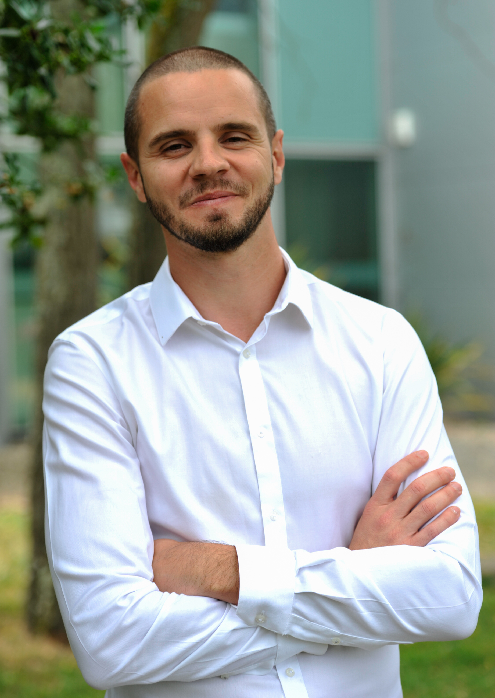
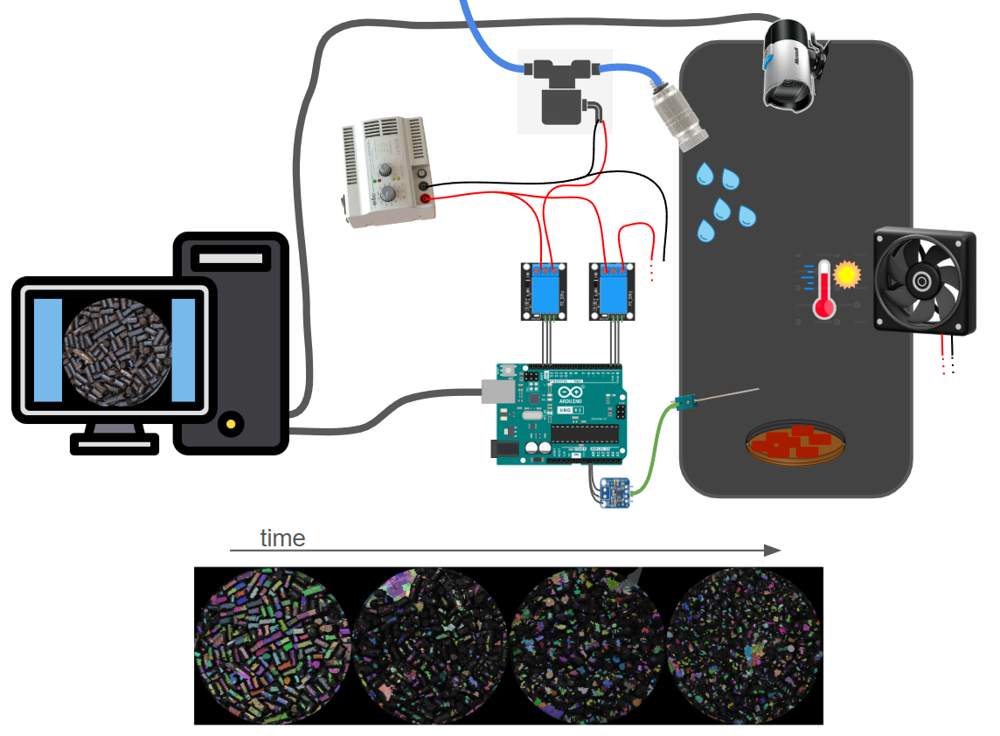
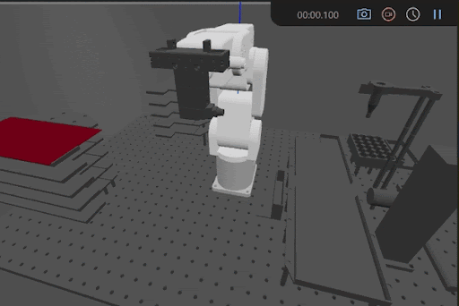
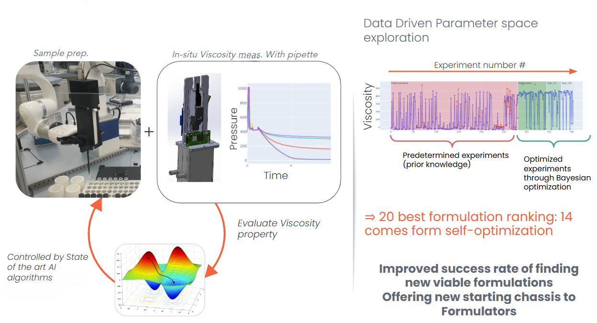
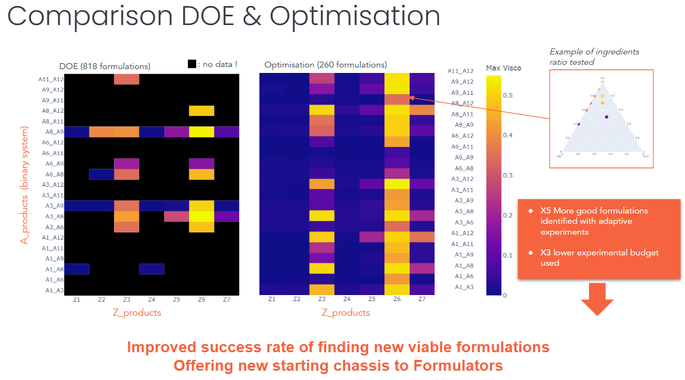
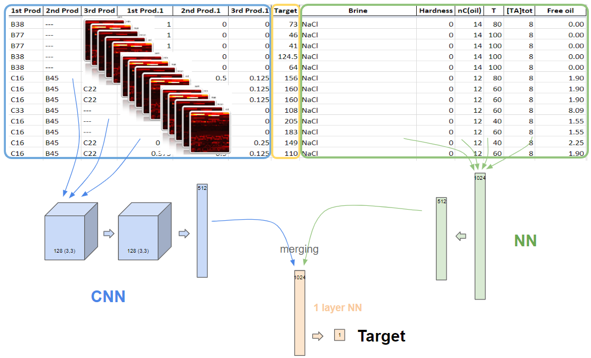

# Jordy Bonnet - Portfolio

  

## 🚀 Overview & Professional Journey

Starting my career at the [Laboratory of the Future (LoF) - Syensqo](https://www.lof.cnrs.fr/) (2009 - Bordeaux, France) as a **laboratory technician** in chemistry and formulation, I quickly trained myself in programming with **Matlab**. My fascination with programming grew rapidly, starting with basic tasks like processing spectrometer data and advancing to complex techniques such as building machine learning models for image classification.

I soon realized that managing the entire **data lifecycle** within an R&D environment required deep programming expertise. Given LoF's focus on miniaturizing and automating lab processes, I joined a newly created team in 2014 to build and develop highly customized automated laboratory systems.

### Core Expertise Acquired:
Through building these advanced systems, I acquired hands-on skills in the following areas:
*   Image analysis
*   Signal processing
*   Lab equipment instrumentation
*   User interface development
*   Data visualization
*   Electronic boards (Arduino / Raspberry Pi)
*   CAD & 3D printing (SolidWorks, Open-scad, Freecad, Raise3D, UltiMaker)

---

## 🤖 Robotics and Automated Systems

I have extensive experience working with a variety of robotic platforms, including the UR5e, UR3e, Doosan-A0509s, MECA500, xArm, and uArm. My work has spanned from simple aging setups (mimicking weather) with advanced image analysis characterization to sophisticated robotized plateforms:

   
  ...to more sophisticated robotised plateforms: 
  

---

## 🧠 Data Science & AI Specialization (Since 2018)

Driven by a curiosity for cutting-edge algorithmic technologies, I joined the data scientist team in 2018 and have focused on advanced topics including:
*   Web scraping
*   Machine learning / Deep Learning
*   AI assisted imagery analysis
*   Bayesian optimization
*   Intrinsic curiosity algorithms
*   Agentic AI assistant (RAG, GraphRAG, LangChain, LLM Knowledge Bases, ...)

### Key Project Highlights:

**1. Intelligent Shampoo Formulation Platform (Self-Driving Labs) - 2023**
I built an intelligent platform featuring autonomous decision-making through **Bayesian optimization**. This project successfully demonstrated the effectiveness of these algorithms compared to classic experimental design ([DOE](https://asq.org/quality-resources/design-of-experiments)) and human reasoning. We showed that when working with tertiaries (3 products in the same formulation), Bayesian optimization allowed us to discover 5 times more good candidates in 3 times fewer created formulations.

   
  

**2. Chemoinformatics Tool for Oil Recovery (EOR) - 2019**
I designed a **chemoinformatic** tool for predicting the optimal salinity of surfactant mixtures in EOR. This involved building a model using [TensorFlow](https://www.tensorflow.org/?hl=fr), combining a [CNN](https://en.wikipedia.org/wiki/Convolutional_neural_network) and [NN](https://en.wikipedia.org/wiki/Neural_network), and deploying it on Dataiku.

  

**Overall Impact:** I have successfully led and delivered numerous data-driven projects, leveraging my expertise to build **full package projects**, covering everything from data acquisition and analysis to visualization and UI using tools like Dash Plotly mostly.

---

## 🎓 Professional Focus Areas & Training

I am passionate about sharing knowledge in the fields of **robotics mechatronics engineer** and **data scientist**. I have also participated as a Python trainer in several professional trainings throughout my career.

---

## ✨ Personal Projects & Continuous Learning

In addition to my professional experience, I continue to learn and grow through personal Python projects:

### 💡 Cycling Adventure (Bayesian-optimized)
*   **Focus:** Using geospatial data and Bayesian optimization.
*   **Details:** [Article](https://medium.com/@jordy.bonnet_67692/automatic-route-planning-generator-16a266d468a5) - 2021
*   **Image:**  
*   **Code:** [Google Colab code](https://colab.research.google.com/drive/1fGgB_teBZbIgSAxNsGE26UVEav00Ehg6)

***

### 🎬 AI-powered video editing with music rhythm matching
*   **Focus:** Using music information retrieval (MIR) and MoviePy.
*   **Details:** [Article](https://medium.com/@jordy.bonnet_67692/automatic-route-planning-generator-16a266d468a5) - 2021
*   **Image:**  
*   **Code:** [Google Colab code](https://colab.research.google.com/drive/1Axstvp1KfwQxhqdDhQJdRBd0RpA_ME-n?usp=sharing)

***

### 🃏 Free (Open sourced) Print and Play (PnP) deck building card game
*   **Focus:** Using local LLM & Wan2.2 to generate 7500+ illustrations.
*   **Details:** [Webpage](https://huggingface.co/spaces/jordyBonnet/GlobeRunners) - 2025
*   **Image:**  
*   **Code:** [Github](https://github.com/jordyBonnet/GlobeRunners_dev)

***